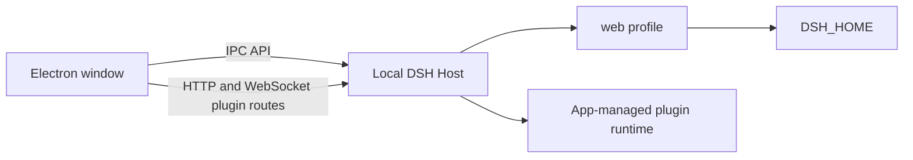

# DSH Desktop Community

English | [中文](README.zh.md)

DSH Desktop Community is an independent Windows distribution of the open-source [DSH agent harness](https://github.com/deepseek-ai/deepseek-harness). This full monorepo keeps the upstream plugin architecture and `@deepseek-ai/*` compatibility namespaces while adding a packaged Electron application, Windows installer, and community release workflow.

> This project is maintained by community contributors and is not an official DeepSeek product or endorsed by DeepSeek. "DeepSeek" identifies the upstream project and compatibility namespaces only; this distribution uses its own name and artwork.

## Download

[**Download DSH Desktop Community for Windows x64**](https://github.com/jiazhengfu912-lang/dsh-desktop-community/releases/latest/download/DSH-Desktop-Community-Setup-x64.exe)

The first release is an unsigned community preview. Windows SmartScreen may display an unknown-publisher warning. Download only from this repository's [Releases](https://github.com/jiazhengfu912-lang/dsh-desktop-community/releases) page and compare the installer against `SHA256SUMS.txt` from the same release:

```powershell
Get-FileHash .\DSH-Desktop-Community-Setup-x64.exe -Algorithm SHA256
```

<a id="run"></a>

## Requirements and installation

- Windows 10 or Windows 11 on x64 hardware.
- A model provider and credentials configured through DSH settings.
- [Git for Windows](https://git-scm.com/download/win) only for `github:`, `git+https:`, and other Git-backed plugins. Registry and local-file plugins use the application-managed pnpm runtime.

Close every DSH Web Host and desktop instance before installation or update, then run the downloaded installer. DSH Desktop Community uses an independent application identity and does not replace an upstream-branded installation. The preview has no automatic updater; install a newer version by downloading and running its installer.

Windows uninstallation removes the application but preserves the user's DSH Host data. See the [desktop application reference](apps/desktop/README.md) for startup, plugin-runtime, storage, update, and uninstall details.

## Local DSH data reuse

On the same computer, under the same Windows user, and with the same `DSH_HOME`, Desktop opens the existing `web` profile and reuses healthy local Host data in place. This is not a complete migration or synchronization feature.

| Reused | Not migrated or repaired |
| --- | --- |
| Sessions, attachments, settings, credential references, profiles, plugin declarations, presets, and user skills under the same `DSH_HOME` | Browser `localStorage`, drafts, layout, selection state, cloud conversations, data from another computer or user, and corrupt session logs |
| Workspace records whose absolute project paths remain accessible | Project files themselves or workspaces whose original paths are unavailable |

A custom Web Host home is shared only when the desktop process receives the same persistent `DSH_HOME` environment variable. Do not run Web and Desktop Hosts against one home concurrently. The [desktop application reference](apps/desktop/README.md) owns the complete data and concurrency limits.

## Repository architecture



The desktop application depends on workspace packages across the Host, client, session, settings, and plugin layers, so the repository remains a full DSH monorepo. Read the [desktop application reference](apps/desktop/README.md) for its entrypoints and the upstream [architecture reference](docs/architecture.md) for shared components.

<a id="run-from-source"></a>

## Build from source

Install Node.js `^22.19.0` or `>=24.0.0` and pnpm `11.7.0`, then run:

```powershell
git clone https://github.com/jiazhengfu912-lang/dsh-desktop-community.git
Set-Location dsh-desktop-community
corepack enable pnpm
pnpm install --frozen-lockfile
pnpm run build
pnpm --filter @deepseek-ai/dsh-desktop typecheck
pnpm --filter @deepseek-ai/dsh-desktop test
pnpm --filter @deepseek-ai/dsh-desktop package
```

Generated installers belong in GitHub Releases, not Git history. Every published release includes the installer, `SHA256SUMS.txt`, and `build-info.json`; its Windows workflow covers source checks, packaged startup and plugin smokes, installation, installed launch, metadata and license checks, and uninstallation.

## Release limits

- Windows x64 is the only packaged platform.
- Installers are unsigned and may trigger SmartScreen.
- The preview has no automatic updater.
- Pre-release DSH data formats have no general compatibility guarantee across unrelated versions.
- Cross-computer transfer, browser UI-state import, cloud import, and corrupt-log repair are not provided.

## Community and license

Use [Support](SUPPORT.md) to choose between Discussions, desktop bug reports, and upstream reports. Read [Security](SECURITY.md) before reporting a vulnerability and [Contributing](CONTRIBUTING.md) before submitting a pull request.

The source is available under the [MIT License](LICENSE). Third-party packages and their licenses are listed in [THIRD_PARTY_NOTICES.md](THIRD_PARTY_NOTICES.md).
