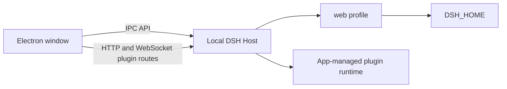

# DSH Desktop Community

[English](README.md) | 中文

DSH Desktop Community 是开源 [DSH agent harness（智能体框架）](https://github.com/deepseek-ai/deepseek-harness)的独立 Windows 发行版。这个完整 monorepo 保留上游插件架构和 `@deepseek-ai/*` 兼容命名空间，同时增加打包 Electron 应用、Windows 安装程序和社区发行工作流。

> 本项目由社区贡献者维护，不是 DeepSeek 官方产品，也未获得 DeepSeek 背书。“DeepSeek”仅用于标识上游项目和兼容命名空间；本发行版使用独立名称和美术资源。

## 下载

[**下载适用于 Windows x64 的 DSH Desktop Community**](https://github.com/jiazhengfu912-lang/dsh-desktop-community/releases/latest/download/DSH-Desktop-Community-Setup-x64.exe)

首个版本是未签名的社区预览版。Windows SmartScreen 可能显示未知发布者警告。请只从本仓库的 [Releases](https://github.com/jiazhengfu912-lang/dsh-desktop-community/releases) 页面下载，并将安装程序与同一版本中的 `SHA256SUMS.txt` 进行比对：

```powershell
Get-FileHash .\DSH-Desktop-Community-Setup-x64.exe -Algorithm SHA256
```

<a id="run"></a>

## 系统要求与安装

- 运行在 x64 硬件上的 Windows 10 或 Windows 11。
- 已通过 DSH 设置配置模型提供方和凭据。
- 仅 `github:`、`git+https:` 和其他由 Git 支持的插件需要 [Git for Windows](https://git-scm.com/download/win)。注册表和本地文件插件使用应用管理的 pnpm 运行时。

安装或更新前，关闭所有 DSH Web Host 和桌面实例，然后运行下载的安装程序。DSH Desktop Community 使用独立应用身份，不会替换上游品牌安装。预览版没有自动更新程序；请下载并运行新版本安装程序进行更新。

从 Windows 卸载只会移除应用，并保留用户 DSH Host 数据。启动、插件运行时、存储、更新和卸载细节见[桌面应用参考](apps/desktop/README.md)。

## 本地 DSH 数据复用

在同一台电脑、同一个 Windows 用户且 `DSH_HOME` 相同时，Desktop 会打开现有 `web` profile，并原位复用健康的本地 Host 数据。这不是完整迁移或同步功能。

| 复用 | 不迁移或修复 |
| --- | --- |
| 相同 `DSH_HOME` 下的会话、附件、设置、凭据引用、profiles、插件声明、预设和用户 skills | 浏览器 `localStorage`、草稿、布局、选中状态、云端会话、其他电脑或用户的数据以及损坏的会话日志 |
| 绝对项目路径仍可访问的工作区记录 | 项目文件本身或原路径不可访问的工作区 |

仅当桌面进程接收到相同的持久 `DSH_HOME` 环境变量时，自定义 Web Host home 才会被共享。不要让 Web 和 Desktop Host 同时使用一个 home。完整的数据和并发限制由[桌面应用参考](apps/desktop/README.md)说明。

## 仓库架构



桌面应用依赖 Host、客户端、会话、设置和插件层中的多个工作区包，因此本仓库保留完整 DSH monorepo。应用入口见[桌面应用参考](apps/desktop/README.md)，共享组件见上游[架构参考](docs/architecture.md)。

<a id="run-from-source"></a>

## 从源码构建

安装 Node.js `^22.19.0` 或 `>=24.0.0` 以及 pnpm `11.7.0`，然后运行：

```powershell
git clone https://github.com/jiazhengfu912-lang/dsh-desktop-community.git
Set-Location dsh-desktop-community
corepack enable pnpm
pnpm install --frozen-lockfile
pnpm run build
pnpm --filter @deepseek-ai/dsh-desktop typecheck
pnpm --filter @deepseek-ai/dsh-desktop test
pnpm --filter @deepseek-ai/dsh-desktop package
```

生成的安装程序属于 GitHub Releases，不进入 Git 历史。每个发行版都包含安装程序、`SHA256SUMS.txt` 和 `build-info.json`；其 Windows 工作流覆盖源码检查、打包启动和插件冒烟测试、安装、已安装启动、元数据与许可证检查以及卸载。

## 发行限制

- Windows x64 是唯一打包平台。
- 安装程序未签名，可能触发 SmartScreen。
- 预览版没有自动更新程序。
- 预发行 DSH 数据格式在不相关版本之间不提供通用兼容保证。
- 不提供跨电脑传输、浏览器 UI 状态导入、云端导入和损坏日志修复。

## 社区与许可证

请通过[支持](SUPPORT.md)确定应使用 Discussions、桌面 bug 报告还是上游报告。报告漏洞前请阅读[安全政策](SECURITY.md)，提交 PR 前请阅读[贡献指南](CONTRIBUTING.md)。

源码采用 [MIT License](LICENSE)。第三方包及其许可证列于 [THIRD_PARTY_NOTICES.md](THIRD_PARTY_NOTICES.md)。
