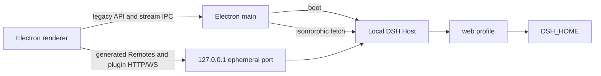

# DSH Desktop Community application

English | [中文](README.zh.md)

`@deepseek-ai/dsh-desktop` is the Windows Electron carrier for DSH Desktop Community. It composes the shared `web` profile with a desktop overlay, carries legacy API requests and streams over a typed IPC bridge, and serves generated Remote calls plus third-party plugin routes from a loopback-only HTTP server.

## Entrypoints and startup

[`src/main/index.ts`](src/main/index.ts) owns the Electron lifecycle, single-instance lock, splash window, hidden application window, Host boot, menu removal, window persistence, and shutdown. [`src/renderer/main.ts`](src/renderer/main.ts) loads the Host-provided client graph, evaluates registered client bundles, and reports either `rendererReady` or `rendererFailed` through the preload bridge.

Startup follows one visible handoff:

1. Electron creates and shows the local splash document.
2. The main process resolves and boots the DSH Host without blocking splash animation.
3. A hidden application window loads the settled loopback Host and waits for all client plugins.
4. `rendererReady` reveals the application window and closes the splash; a Host or renderer error remains on the splash with retry and quit actions.

The application menu is cleared before either window is created. Electron's process-wide lock is acquired before startup; a second launch asks the existing process to focus instead of starting another Host, and a request received before either window is ready is retained until the splash becomes visible.

## Transport and data flow



Legacy ApiProxy requests and event streams use fixed IPC channels validated by [`src/main/ipc-bridge.ts`](src/main/ipc-bridge.ts). Generated Remotes and installed web plugins keep their relative HTTP and WebSocket routes on the loopback origin. The server binds `127.0.0.1` on an operating-system-assigned port; it is not a LAN server.

The preload does not expose a generic `ipcRenderer`. Every renderer-to-main channel is assigned to either the application or splash role, and the main process requires the current role's exact `WebContents`, main frame, URL, and origin. Both windows deny renderer-initiated document navigation, redirects, and child windows; lifecycle-owned `loadURL`, `loadFile`, and splash reload operations remain in the main process.

Electron UI preferences use the app-specific `desktop-storage.json` under Electron `userData`. That store is separate from browser `localStorage` and from the Host data directory.

## `DSH_HOME` reuse

[`src/main/host-boot.ts`](src/main/host-boot.ts) calls the shared DSH home resolver and loads the ordinary `web` profile with its user layer. On the same computer, for the same Windows user and the same `DSH_HOME`, the desktop Host therefore reuses these records in place:

- sessions and attachments;
- DSH settings and credential references;
- profiles, plugin declarations, presets, and user skills;
- workspace records whose absolute project paths remain accessible.

The application does not copy browser drafts, browser layout or selection state, cloud conversations, project files, another user's data, another computer's data, or corrupt session logs. A custom Web Host home is shared only when the desktop process receives the same persistent `DSH_HOME` environment variable.

Without that environment variable, the shared resolver uses `%USERPROFILE%\.dsh`. Electron preferences and the private plugin command runtime remain under the separately named Electron `userData` directory.

Only one active Host process may own a DSH home. Close the Web Host before launching Desktop and close Desktop before launching Web; the session layer detects conflicting writers, but auxiliary stores do not all provide cross-process locking.

## Desktop overlay and plugins

[`desktop.patch.yml`](desktop.patch.yml) keeps the real loopback web server, disables browser-only startup/HMR glue, selects the Electron directory picker, and adds Better Sidebar plus the workspace-confined document viewer. Its community identity plugin supplies independent artwork and shadows the upstream product-specific welcome notice without changing the shared Web plugin. The overlay also sets `DSH Desktop Community` as the model-visible deployment identity while preserving the shared system-prompt default. A user-provided Better Sidebar row remains authoritative; the desktop fallback is enabled only when another instance is absent.

The Host publishes two desktop services before plugin loaders settle:

| Service | Responsibility |
| --- | --- |
| `desktopProfiles` | Identifies the fixed active `web` profile and its installed bundles |
| `desktopPnpm` | Runs serialized package operations with the packaged Electron-as-Node executable and pnpm entry |

The installer does not preinstall `dshmarket`. If `dshmarket` is already installed in the same `web` profile, Desktop loads it with that profile and supplies the managed `desktopProfiles` and `desktopPnpm` services; market operations do not depend on global `dsh` or pnpm executables.

Registry and local-file plugin operations use the private runtime under Electron `userData`; they do not require a global `dsh`, Node, or pnpm executable. The runtime keeps pnpm's `store` and `cache` directories under that app-specific directory while preserving the active profile's `.npmrc` and inherited proxy configuration. The Desktop handoff invokes the packaged pnpm JavaScript entry without a command shell, preserving Unicode paths and Windows command metacharacters as literal argv. Git-backed specifications require Git for Windows on `PATH`. Missing Git is reported before pnpm starts. Disposing the Host terminates and joins an active package operation.

## Development commands

Run these commands from the repository root after `pnpm install --frozen-lockfile`:

```powershell
pnpm run build
pnpm --filter @deepseek-ai/dsh-desktop typecheck
pnpm --filter @deepseek-ai/dsh-desktop test
pnpm --filter @deepseek-ai/dsh-desktop dev
pnpm --filter @deepseek-ai/dsh-desktop package
```

`dev` starts Electron from workspace output. `package` builds the main process and renderer, regenerates the Windows icon, creates the NSIS x64 package, then runs packaged worker and startup/plugin smokes. Generated output belongs under `apps/desktop/release/` and is not committed.

## Release validation

| Layer | Evidence |
| --- | --- |
| Source | Root build, desktop TypeScript faces, and desktop unit tests |
| Package closure | Worker-thread dispatch, document-viewer and Better Sidebar Host/Client resolution, and absence of the official UI brand, badge-skill, and unused Web frontend packages plus their whale artwork and `logo=deepseek` markup |
| Packaged startup | Temporary `DSH_HOME`, private pnpm with ambient commands removed, fixture lifecycle install, plugin reconciliation, and plugin inventory |
| Installer | Silent install, installed launch sentinel, shortcut and executable metadata, bundled licenses, silent uninstall, and preserved temporary Host data |
| GUI | Menu absence, one splash handoff, responsive splash animation, and first-window readiness require a visible Windows run |

## Known limitations

- Only Windows x64 receives an installer.
- The community preview is unsigned and has no automatic updater.
- Electron UI storage is independent from browser `localStorage`.
- Same-home reuse is not cross-computer migration and does not repair incompatible or corrupt session logs.
- Git-backed plugins depend on a separate Git for Windows installation.
- Pre-release DSH profile and session formats have no general compatibility promise across unrelated versions.
