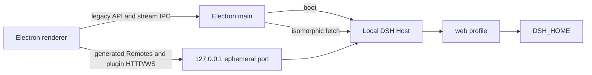

# DSH Desktop Community 应用

[English](README.md) | 中文

`@deepseek-ai/dsh-desktop` 是 DSH Desktop Community 的 Windows Electron 载体。它使用桌面 overlay 组合共享 `web` profile，通过类型化 IPC bridge 承载旧版 API 请求和流，并从仅限回环的 HTTP 服务器提供生成的 Remote 调用和第三方插件路由。

## 入口与启动

[`src/main/index.ts`](src/main/index.ts) 持有 Electron 生命周期、单实例锁、启动窗口、隐藏应用窗口、Host 启动、菜单移除、窗口状态持久化和关闭流程。[`src/renderer/main.ts`](src/renderer/main.ts) 加载 Host 提供的客户端图，执行已注册客户端 bundle，并通过 preload bridge 报告 `rendererReady` 或 `rendererFailed`。

启动只进行一次可见交接：

1. Electron 创建并显示本地启动文档。
2. 主进程解析并启动 DSH Host，同时不阻塞启动动画。
3. 隐藏应用窗口加载已完全停稳的回环 Host，并等待所有客户端插件。
4. `rendererReady` 显示应用窗口并关闭启动窗口；Host 或 renderer 错误会保留在启动窗口中，并提供重试和退出操作。

应用菜单会在创建任何窗口之前清除。Electron 的进程级锁会在启动前获取；第二次启动会要求现有进程聚焦，而不是启动另一个 Host；若请求到达时窗口尚未就绪，则会保留到启动窗口可见后执行。

## 传输与数据流



旧版 ApiProxy 请求和事件流使用由 [`src/main/ipc-bridge.ts`](src/main/ipc-bridge.ts) 验证的固定 IPC channel。生成的 Remotes 和已安装 Web 插件继续在回环 origin 上使用相对 HTTP 和 WebSocket 路由。服务器绑定 `127.0.0.1` 上由操作系统分配的端口；它不是局域网服务器。

preload 不公开通用 `ipcRenderer`。每个 renderer 到主进程的 channel 都归属于应用或启动窗口角色，主进程要求消息来自当前角色的准确 `WebContents`、主 frame、URL 和 origin。两个窗口都拒绝 renderer 发起的文档导航、重定向和子窗口；生命周期持有的 `loadURL`、`loadFile` 和启动窗口重新加载仍由主进程执行。

Electron UI 偏好使用 Electron `userData` 下应用专属的 `desktop-storage.json`。该存储与浏览器 `localStorage` 以及 Host 数据目录相互独立。

## `DSH_HOME` 复用

[`src/main/host-boot.ts`](src/main/host-boot.ts) 调用共享 DSH home 解析器，并加载带用户层的常规 `web` profile。因此，在同一台电脑、同一个 Windows 用户和相同 `DSH_HOME` 下，桌面 Host 会原位复用以下记录：

- 会话和附件；
- DSH 设置和凭据引用；
- profiles、插件声明、预设和用户 skills；
- 绝对项目路径仍可访问的工作区记录。

应用不复制浏览器草稿、浏览器布局或选中状态、云端会话、项目文件、其他用户的数据、其他电脑的数据或损坏的会话日志。仅当桌面进程接收到相同的持久 `DSH_HOME` 环境变量时，自定义 Web Host home 才会被共享。

没有该环境变量时，共享解析器使用 `%USERPROFILE%\.dsh`。Electron 偏好和私有插件命令运行时仍位于独立命名的 Electron `userData` 目录下。

一个 DSH home 只能由一个活动 Host 进程持有。启动 Desktop 前关闭 Web Host，启动 Web 前关闭 Desktop；会话层会检测冲突写入，但并非所有辅助存储都提供跨进程锁。

## 桌面 overlay 与插件

[`desktop.patch.yml`](desktop.patch.yml) 保留真实回环 Web 服务器，禁用仅用于浏览器的启动/HMR glue，选择 Electron 目录选择器，并添加 Better Sidebar 和受工作区限制的文档查看器。社区身份插件提供独立图稿，并且在不改动共享 Web 插件的情况下遮蔽上游产品专属的欢迎声明。overlay 还会把 `DSH Desktop Community` 设为模型可见的部署身份，同时保留共享 system-prompt 默认值。用户提供的 Better Sidebar 配置项保持权威；只有不存在其他实例时才启用桌面 fallback。

Host 会在插件 loader 完全停稳前发布两个桌面服务：

| 服务 | 职责 |
| --- | --- |
| `desktopProfiles` | 标识固定的活动 `web` profile 及其已安装 bundle |
| `desktopPnpm` | 使用打包的 Electron-as-Node 可执行文件和 pnpm 入口运行串行包操作 |

安装包不预装 `dshmarket`。如果同一 `web` profile 已安装 `dshmarket`，Desktop 会随该 profile 加载它并提供托管的 `desktopProfiles` 与 `desktopPnpm` 服务；市场操作不依赖全局 `dsh` 或 pnpm 可执行文件。

注册表和本地文件插件操作使用 Electron `userData` 下的私有运行时；它们不要求全局 `dsh`、Node 或 pnpm 可执行文件。该运行时把 pnpm 的 `store` 和 `cache` 目录放在这个应用专属目录下，同时保留活动 profile 的 `.npmrc` 与继承的代理配置。Desktop 交接会绕过命令 shell，直接调用随包 pnpm JavaScript 入口，因此 Unicode 路径和 Windows 命令元字符会作为原始 argv 保留。由 Git 支持的规格要求 `PATH` 中存在 Git for Windows。缺少 Git 会在 pnpm 启动前报告。Host dispose 时会终止并等待活动包操作结束。

## 开发命令

执行 `pnpm install --frozen-lockfile` 后，在仓库根目录运行以下命令：

```powershell
pnpm run build
pnpm --filter @deepseek-ai/dsh-desktop typecheck
pnpm --filter @deepseek-ai/dsh-desktop test
pnpm --filter @deepseek-ai/dsh-desktop dev
pnpm --filter @deepseek-ai/dsh-desktop package
```

`dev` 从工作区输出启动 Electron。`package` 构建主进程和 renderer，重新生成 Windows 图标，创建 NSIS x64 软件包，然后运行打包 worker 以及启动/插件冒烟测试。生成输出属于 `apps/desktop/release/`，不得提交。

## 发行验证

| 层级 | 证据 |
| --- | --- |
| 源码 | 根构建、桌面 TypeScript faces 和桌面单元测试 |
| 软件包闭包 | 从打包应用解析 worker-thread 调度、文档查看器和 Better Sidebar Host/Client，并确认官方 UI 品牌包、badge skill 包、未使用的 Web frontend 包及其鲸鱼美术和 `logo=deepseek` 标记均不存在 |
| 打包启动 | 临时 `DSH_HOME`、移除环境命令后的私有 pnpm、fixture 生命周期安装、插件协调和插件清单 |
| 安装程序 | 静默安装、已安装启动标记、快捷方式和可执行文件元数据、随附许可证、静默卸载和保留的临时 Host 数据 |
| GUI | 菜单缺失、一次启动交接、响应式启动动画和首个窗口就绪需要可见 Windows 运行 |

## 已知限制

- 只有 Windows x64 获得安装程序。
- 社区预览版未签名且没有自动更新程序。
- Electron UI 存储独立于浏览器 `localStorage`。
- 同 home 复用不是跨电脑迁移，也不修复不兼容或损坏的会话日志。
- 由 Git 支持的插件依赖单独安装的 Git for Windows。
- 预发行 DSH profile 和会话格式在不相关版本之间不提供通用兼容承诺。
